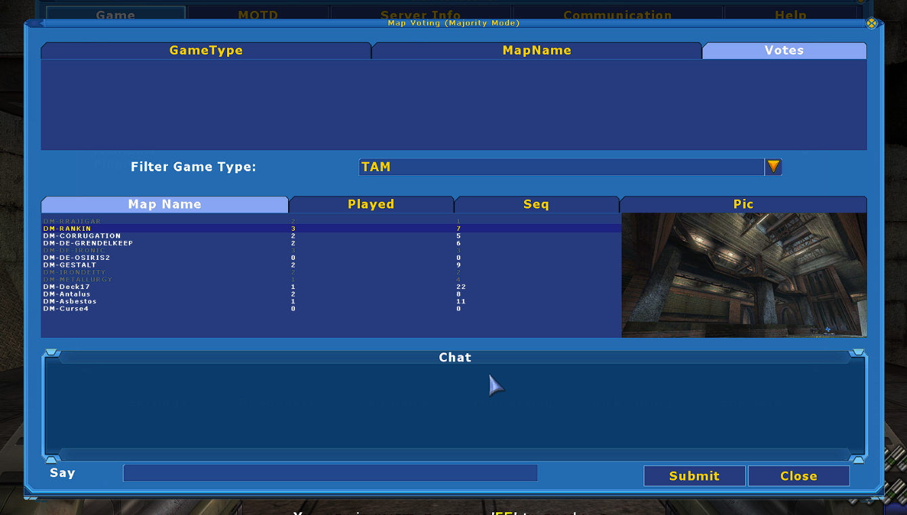

# WSVoting


WSVoting is a mutator to show a preview of the map during map voting.  Normally the preview only works if the player has the map downloaded.  This mutator uses a texture package to load screenshots from.




## Usage 

On the server, enable `WSVoting.MutWSVoting` mutator.  Add `WSVotingScreenshots.utx` to the Textures folder.  In your UT2004.ini, under ServerPackages, add `WSVotingScreenshots`, and any other Texture packages you reference.


## Config

WSVoting.ini
```
[WSVoting.WSVotingConfig]
DefaultTexturePackage=WSVotingScreenshots
Maps=(MapName="Map Name",Texture="TexturePackage.TextureName")
```

The mutator will first look for a matching `Maps` line, where the MapName property matches the name of the map, e.g. `MapName="DM-Rankin"`.  If found, the `Texture` value will be used as the screenshot for that map. Using the `Maps` list allows using different texture packages for different maps. 

If no matching `Maps` line is found, the mutator will attempt to load the texture from the DefaultTexturePackage, looking for a Material with the same name as the map, e.g. `WSVotingScreenshots.DM-Rankin`.  

If no texture can be found, a 'No Preview Available' texture is used.

